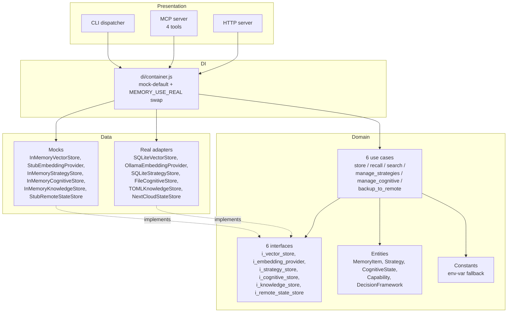
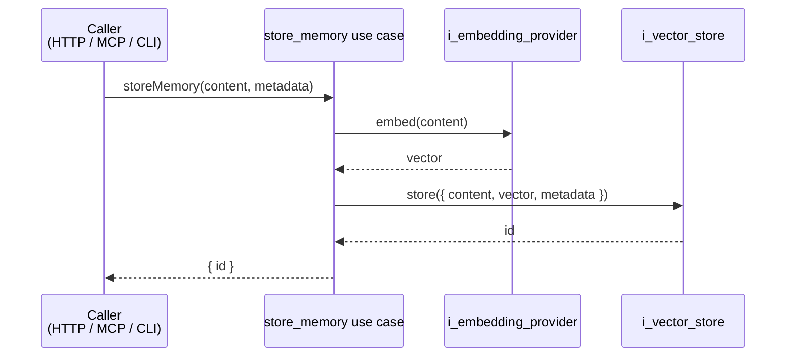
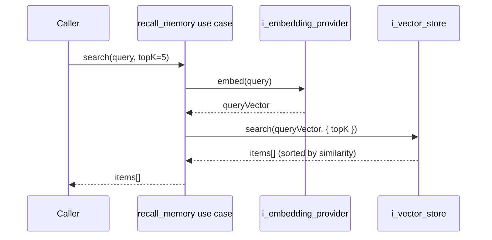
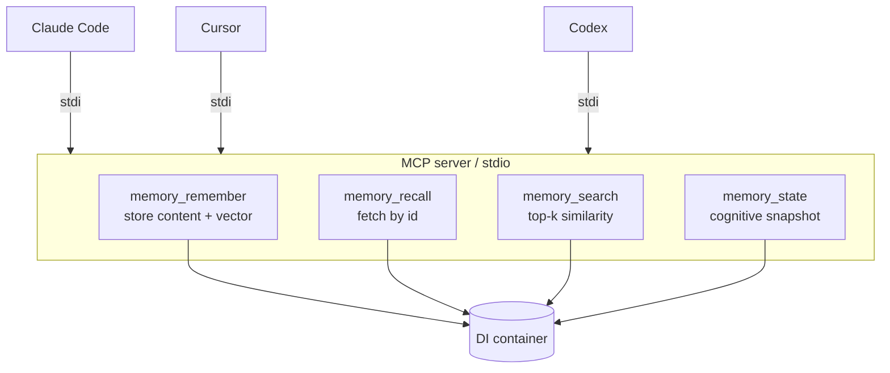

# ARCHITECTURE.md

How ai-memory is structured, where reads + writes flow, and where the mock-vs-real swap happens.

For the why, start with [README.md](README.md).

---

## 1. Clean architecture layering



Same dependency rule as the rest of the nervous-system stack: domain has no imports from data or presentation.

---

## 2. Write flow (remember)



Two collaborators: an embedder turns text into a vector, a vector store persists the pair. The use case never touches I/O directly.

---

## 3. Read flow (search)



Same collaborators, opposite direction. The embedder + vector store are the only abstractions that have to agree on dimensionality (default 768 to match `nomic-embed-text:v1.5`).

---

## 4. Mock vs real swap

```mermaid
flowchart LR
    Env[MEMORY_USE_REAL env var<br/>"" / "store,embedder" / "all"]
    Container[createContainer]
    Decide{For each integration<br/>in KNOWN_KEYS:<br/>is it in useReal?}
    Real[Real adapter<br/>SQLite, Ollama, NextCloud]
    Mock[Stub<br/>Map-backed, hash-derived]
    Bundle[Container bundle<br/>{vectorStore, embedder,<br/>strategyStore, cognitiveStore,<br/>knowledgeStore, remoteStateStore}]

    Env --> Container
    Container --> Decide
    Decide -- "yes" --> Real
    Decide -- "no (default)" --> Mock
    Real --> Bundle
    Mock --> Bundle
```

Six swap keys: `store`, `embedder`, `strategies`, `cognitive`, `knowledge`, `remote`.

The stub embedder is deterministic — same input produces the same vector — so cosine search still ranks correctly. You don't get *semantic* similarity (the synthetic vectors aren't trained), but you get reproducible behavior, which is what tests need.

---

## 5. PROTOCOL-12 cognitive continuity

```mermaid
flowchart LR
    Session1[Session 1<br/>agent does work]
    Reflect[reflection.json<br/>"this is what I learned"]
    Attend[attention.json<br/>"this is what to focus on next"]
    Calibrate[calibration.json<br/>"this is how confident I am"]
    Session2[Session 2<br/>boot reads them]

    Session1 --> Reflect
    Session1 --> Attend
    Session1 --> Calibrate
    Reflect -.persists across crash/restart.-> Session2
    Attend -.-> Session2
    Calibrate -.-> Session2
```

These three files are how raj-sadan's agent maintains continuity across sessions. The agent writes them before exit; the boot sequence reads them and uses them to construct the new session's prompt.

`InMemoryCognitiveStore` keeps these in process — useful for tests but loses state on restart. `FileCognitiveStore` persists to JSON files on disk — that's what raj-sadan uses in production.

The contract is in CONTRACTS.md (when written) — same file format any consumer can read.

---

## 6. MCP tool surface



Four tools. Each one is a thin wrapper around a container method. Add a tool: register it in `src/presentation/mcp/server.js` and document it in the README.

---

## What's deliberately not here

- **Embedding model fine-tuning.** ai-memory holds vectors; it doesn't train the embedder. Real consumers wire whichever Ollama-served model they prefer (via `MEMORY_EMBEDDING_MODEL`).
- **Forgetting algorithms beyond decay.** Strategy weights decay over time and respond to reinforce/weaken signals. There's no "active forgetting" use case in v0.1.0 — when a memory item is no longer relevant, the calling agent decides whether to delete it.
- **Cross-organ orchestration.** ai-memory persists state and answers queries. It doesn't decide what's worth remembering — that's the cognitive layer's job (ai-mind).

---

## See also

- [README.md](README.md)
- [CHANGELOG.md](CHANGELOG.md)
- [`src/di/container.js`](src/di/container.js) — the swap mechanism
- [`src/presentation/mcp/server.js`](src/presentation/mcp/server.js) — the four tools
